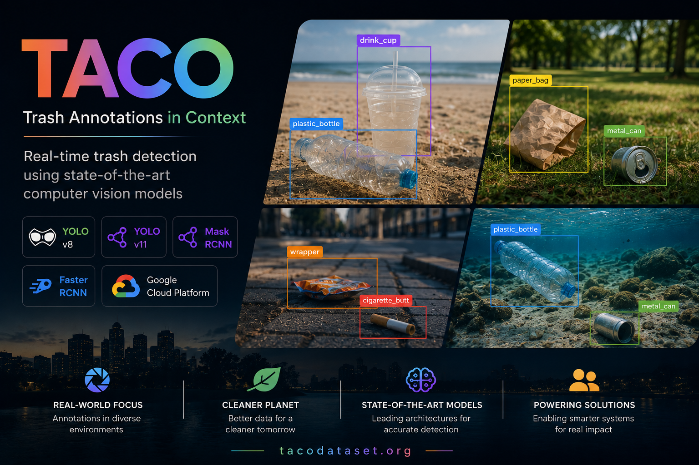
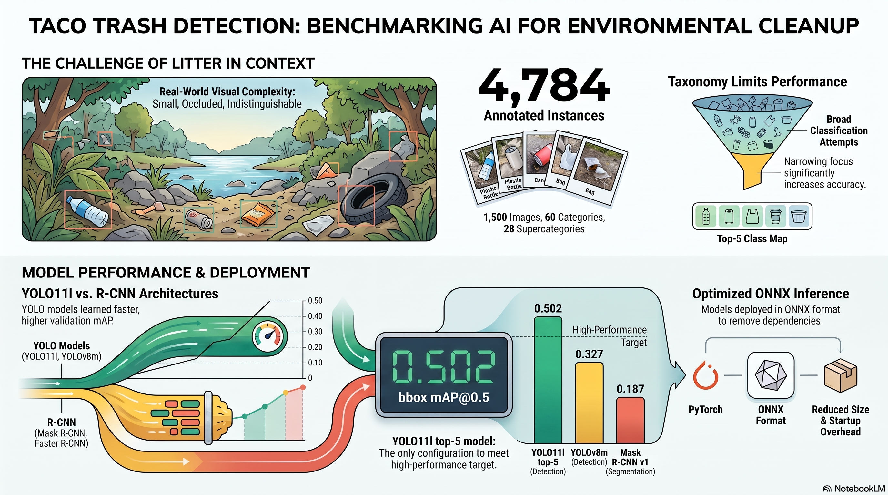
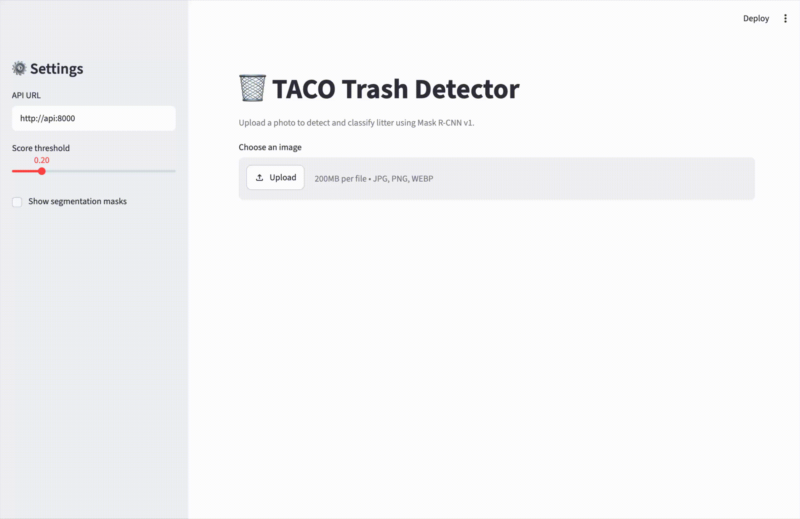
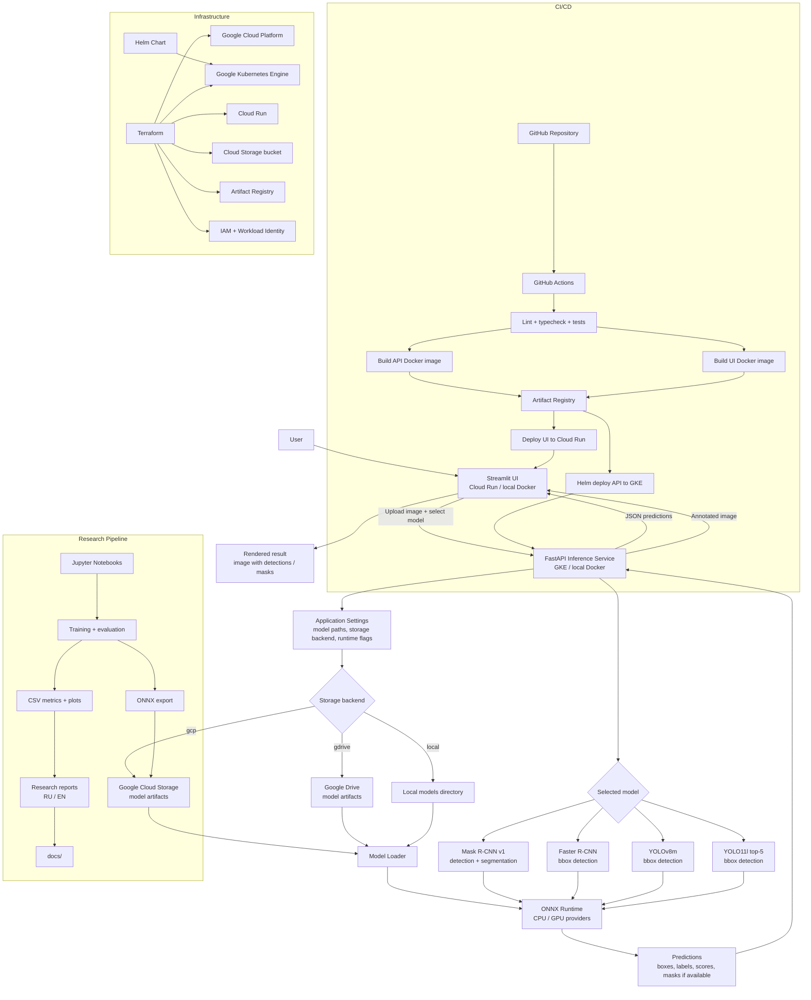

# Trash Annotations in Context

[](https://github.com/vsokoltsov/taco-trash-detection/actions/workflows/ci.yml)



[](https://www.python.org/)
[](https://fastapi.tiangolo.com/)
[](https://streamlit.io/)
[](https://onnxruntime.ai/)
[](https://www.docker.com/)
[](https://cloud.google.com/)
[](https://cloud.google.com/kubernetes-engine)
[](https://cloud.google.com/run)
[](https://cloud.google.com/storage)
[](https://www.terraform.io/)
[](https://helm.sh/)
[](https://github.com/features/actions)
[](https://docs.astral.sh/uv/)
[](https://docs.astral.sh/ruff/)
[](https://docs.pytest.org/)

This project explores trash and litter detection using the [TACO dataset](https://github.com/pedropro/TACO) and instance detection/segmentation models.

The work is implemented primarily in Jupyter notebooks and focuses on evaluating how well different model and label configurations detect litter in real-world images.

This repository was prepared as the final project for the [Deep Learning School](https://dls.samcs.ru/) [Computer Vision course](https://dls.samcs.ru/part1). The course covers computer-vision topics including convolutional neural networks, image segmentation, and object detection.

## 🔗 Useful Links

- [TACO dataset website](http://tacodataset.org/)
- [TACO paper](https://arxiv.org/pdf/2003.06975)
- [Dataset and original implementation](https://github.com/pedropro/TACO)
- [Deep Learning School](https://dls.samcs.ru/)
- [Deep Learning School Computer Vision course](https://dls.samcs.ru/part1)
- [TorchMetrics mAP documentation](https://lightning.ai/docs/torchmetrics/stable/detection/mean_average_precision.html)
- [Torchvision Mask R-CNN v2](https://docs.pytorch.org/vision/main/models/generated/torchvision.models.detection.maskrcnn_resnet50_fpn_v2.html)
- [Torchvision Faster R-CNN](https://docs.pytorch.org/vision/main/models/faster_rcnn.html)

## ❓ Problem Statement



Litter and pollution are worldwide environmental problems. Trash objects in real scenes are often small, occluded, deformed, transparent, dirty, or visually similar to the background. This makes detection in uncontrolled environments harder than detecting clean, isolated recyclable objects.

The goal of this project is to investigate whether computer vision models can detect litter instances in context and to understand which factors limit model quality.

## 🎯 Objective

This project aims to:

- train and evaluate object detection / instance segmentation models on TACO;
- compare label setups such as classless detection, top-N supercategories, and merged categories;
- diagnose why multiclass classification quality is low;
- prepare the model and notebooks for later API/service integration.

## 📑 Research Track Report

The detailed research report required for the **Deep Learning School research track** is available in two versions:

- [Research report in Russian](docs/research_report_ru.md);
- [Research report in English](docs/research_report_en.md).

The reports summarize the task, metrics, tested architectures, training curves and plots, hypotheses, result analysis, and possible future improvements.

## ▶️ Demo

* https://taco-trash-ui-riccx6oj7q-ew.a.run.app/

> **Note:** The deployed application may be unavailable because the cloud infrastructure can be stopped or destroyed to avoid ongoing GCP costs. The project can still be run locally with Docker Compose using the instructions below.



## 🗂️ Dataset

The project uses [Trash Annotations in Context](https://github.com/pedropro/TACO).

Key dataset properties:

- 1,500 real-world images;
- 4,784 annotated litter instances according to the paper;
- polygon masks and bounding boxes for each litter object;
- 60 fine-grained categories grouped into 28 supercategories;
- strong class imbalance and many visually ambiguous labels.

The paper explicitly notes that all objects may be treated as one class, `litter`, and that some categories can be visually hard to distinguish. This became an important part of the experiments in this project.

## 📄 Paper Baseline

The TACO paper reports Mask R-CNN results on instance segmentation, not only bounding-box detection. The reported scores are AP-style mask metrics averaged over IoU thresholds, following the COCO-style evaluation protocol. Because of that, these numbers should not be compared directly with this project's main `bbox_map_50` metric.

The paper evaluates two taxonomy settings:

- `TACO_1`: classless litter detection/segmentation, where every annotated object is treated as `litter`;
- `TACO_10`: multiclass litter detection/segmentation using 9 frequent supercategories plus an `Other` class.

The table below reports the paper's AP-style mask results:

| Dataset | Class score | Litter score | Ratio score |
|:--|--:|--:|--:|
| TACO_1 | $15.9 \pm 1.0$ | $26.2 \pm 1.0$ | $26.1 \pm 1.0$ |
| TACO_10 | $17.6 \pm 1.6$ | $18.4 \pm 1.5$ | $19.4 \pm 1.5$ |

The three columns use different prediction ranking strategies:

- **Class score** uses the maximum class probability among foreground classes. It is most relevant for multiclass classification.
- **Litter score** uses the probability of being any litter object rather than background. It is especially relevant for classless litter detection.
- **Ratio score** compares the strongest foreground class probability against the background probability.

The paper defines the scores as:

$$
Scores =
\begin{cases}
\max_i p_i, & \text{class score} \\
1 - p_{N+1}, & \text{litter score} \\
\frac{\max_i p_i}{p_{N+1} + \epsilon}, & \text{ratio score}
\end{cases}
$$

where $p_{N+1}$ is the background probability.

In this project, the course target metric is bbox `mAP@0.5`, so the paper's mask AP values are used as context rather than as a strict baseline. The important qualitative comparison is consistent: classless litter detection is easier than fine-grained multiclass litter classification.

## 📶 Evaluation Metrics

The main project metric is bbox mean average precision:

- `bbox_map_50`: bounding-box mAP at IoU threshold 0.5;
- `bbox_map`: COCO-style bbox mAP averaged over multiple IoU thresholds;
- `bbox_mar_100`: mean average recall with up to 100 detections;
- `class_accuracy_on_matches`: class accuracy only for predictions matched to a ground-truth box at IoU >= 0.5;
- `match_rate`: fraction of ground-truth objects that received a matched prediction.

The course requirement scores `mAP@0.5` as:

- `mAP@0.5 < 0.6` - 1 point;
- `mAP@0.5 >= 0.6` - 4 points.

## ⚙️ Environment

The notebooks were run in:

- [Google Colab](https://colab.research.google.com/);
- [Thunder Compute](https://www.thundercompute.com/) with NVIDIA A100 GPU.

The notebooks are adjusted for remote GPU training, checkpoint saving, TensorBoard logging, and CSV-based experiment tracking.

## 🤖 Models

Current implementation status:

- [Torchvision Mask R-CNN ResNet50-FPN](https://docs.pytorch.org/vision/main/models/generated/torchvision.models.detection.maskrcnn_resnet50_fpn.html) for bounding-box detection and instance segmentation;
- [Torchvision Faster R-CNN ResNet50-FPN v2](https://docs.pytorch.org/vision/main/models/faster_rcnn.html) for bounding-box-only detection;
- [YOLOv8m](https://docs.ultralytics.com/models/yolov8) for bounding-box detection;
- [YOLO11l top-5](https://docs.ultralytics.com/models/yolo11/) for the final reduced-class bounding-box detector.

These models are integrated into the FastAPI and Streamlit applications. The UI allows the inference model to be selected for each uploaded image; segmentation-mask rendering is available only for Mask R-CNN.

Other architectures were evaluated experimentally but are not currently exposed as production models:

- [YOLO11x](https://docs.ultralytics.com/models/yolo11);
- [RT-DETR](https://docs.ultralytics.com/models/rtdetr).

### Mask R-CNN v2 experiment

[Torchvision Mask R-CNN ResNet50-FPN v2](https://docs.pytorch.org/vision/main/models/generated/torchvision.models.detection.maskrcnn_resnet50_fpn_v2.html) was evaluated through a heads-only stage and five full-model training attempts. Its best checkpoint reached approximately `0.079` bbox mAP@0.5 and `0.035` COCO-style bbox mAP, compared with `0.187` and `0.126` for Mask R-CNN v1.

The fifth attempt regressed to approximately `0.069` bbox mAP@0.5, confirming that the existing v2 configuration had plateaued. Mask R-CNN v2 is therefore retained only as a documented experiment and is not exposed as an available API or UI model. The complete configuration, visualizations, cycle-by-cycle observations, and stopping decision are available in [`notebooks/05_mask_rcnn_v2.ipynb`](notebooks/05_mask_rcnn_v2.ipynb).

### Inference format

The web service runs both models in **ONNX format**, not from their original PyTorch checkpoints. This removes the PyTorch and torchvision dependencies from the production container, reducing image size and startup overhead.

The export processes are documented in:

- [`notebooks/06_inference.ipynb`](notebooks/06_inference.ipynb) for Mask R-CNN v1;
- [`notebooks/06_inference_yolo_v8.ipynb`](notebooks/06_inference_yolo_v8.ipynb) for YOLOv8;
- [`notebooks/05_yolo_v11.ipynb`](notebooks/05_yolo_v11.ipynb) for YOLO11 training, validation, and export context;
- [`notebooks/06_inference_fast_rcnn.ipynb`](notebooks/06_inference_fast_rcnn.ipynb) for Faster R-CNN export context.

The Mask R-CNN export wraps the model for fixed single-image ONNX-compatible I/O and uses tracing-based export. The Faster R-CNN export uses a fixed `1024 × 1024` input and returns boxes, labels, and scores without masks. The YOLOv8 export uses a fixed `1024 × 1024` input and embeds non-maximum suppression in the ONNX graph. The YOLO11 top-5 export uses a fixed `1280 × 1280` input and also embeds non-maximum suppression. All models are executed with ONNX Runtime (`onnxruntime-gpu` on Linux and `onnxruntime` during CPU development).

> **Note:** `dynamo=True` export is not supported for Mask R-CNN because the RPN uses data-dependent NMS whose output size cannot be resolved statically at export time. Tracing-based export (`dynamo=False`) is used for this architecture.

## 🏆 Best Model Results

The best bounding-box detector is **YOLO11l top-5**. It uses a filtered 5-class taxonomy and is the only tested configuration that reached the project target of `mAP@0.5 >= 0.5`. This result should be interpreted as the strongest metric result, not as the most complete taxonomy: the low number of supported classes can limit practical usefulness compared with broader models.

- **Taxonomy**: filtered top-5 class map (`Can`, `Cup`, `Plastic bottle`, `Plastic bottle cap`, `Plastic film`);
- **Architecture**: YOLO11l detection model;
- **Input size**: `1280 × 1280` pixels for training, validation, export, and inference;
- **Optimization**: AdamW with cosine decay;
- **Augmentation**: YOLO color, geometric, flip, and mosaic augmentation, with mosaic disabled for the final ten epochs;
- **Model selection**: validation fitness with early stopping.

### Metrics

The final checkpoint was evaluated on the deterministic validation split for the filtered top-5 task. Validation used `imgsz=1280`, confidence threshold `0.001`, IoU threshold `0.7`, and at most 300 detections per image.

| Metric | Value |
|:--|--:|
| bbox mAP@0.5 | **0.502** |
| bbox mAP@0.5:0.95 | **0.350** |
| precision | 0.592 |
| recall | 0.497 |

Top-10 exact, filtered merged top-10, full merged top-10, YOLO11x, and RT-DETR-L experiments did not reach `mAP@0.5 >= 0.5`. Therefore, the YOLO11l top-5 model is used for inference, with the caveat that it detects fewer trash categories than the broader 10-class and 17-class variants.

### Model comparison

| Model | Task | bbox mAP@0.5 | bbox mAP@0.5:0.95 |
|:--|:--|--:|--:|
| Mask R-CNN v1 | Detection + instance segmentation | 0.187 | 0.126 |
| [Mask R-CNN v2, best experimental cycle](notebooks/05_mask_rcnn_v2.ipynb) | Detection + instance segmentation | 0.079 | 0.035 |
| Faster R-CNN merged taxonomy | Detection | 0.143 | 0.096 |
| YOLOv8m | Detection | 0.327 | 0.263 |
| YOLO11l top-5 | Detection | **0.502** | **0.350** |

The comparison should be interpreted with some caution because the models use different task definitions and validation conversions. The YOLO11l top-5 score is the only result that reaches the target threshold, so this checkpoint is selected for the final inference model.

### Key observations

- **Architecture matters.** YOLO models learned useful bounding-box features much faster and reached considerably higher validation mAP than either Mask R-CNN version.
- **Class taxonomy remains a major limitation.** YOLO11l reached the target only for the filtered 5-class setup; expanding to 10 classes consistently reduced mAP. This improves the reported metric but narrows the detector scope, so real-world coverage may be weaker than broader lower-mAP models.
- **Training beyond the best epoch was not useful.** Deployment uses `best.pt` exported to ONNX, not `last.pt`.
- **Evaluation settings must remain fixed.** YOLO validation and ONNX export use fixed image sizes and NMS thresholds, so re-evaluation must keep the same image size, confidence threshold, IoU threshold, and maximum-detection settings.
- **Mask R-CNN remains useful when instance masks are required.** Its Dice score was high for matched objects even though its bounding-box recall and mAP were lower.

### Progress across experiments

| Stage | bbox mAP@0.5 |
|:--|--:|
| Mask R-CNN heads-only, top-10 classes | 0.118 |
| Mask R-CNN v1, final checkpoint | 0.187 |
| YOLOv8m, 3-epoch smoke test | 0.222 |
| YOLOv8m, 15-epoch pilot | 0.230 |
| YOLOv8m, final continuation | **0.327** |

---

## 🏗️ Project structure

```
.                                                       <- project root with application code,
  notebooks, docs, and deployment configuration
  ├── docs                                                <- research reports, presentation/
  report assets, and generated documentation material
  │   └── plots                                           <- plots exported from experiments and
  reports
  ├── infra                                               <- infrastructure-as-code and
  deployment configuration
  │   ├── appengine                                       <- legacy App Engine deployment notes/
  configuration
  │   ├── cloudrun                                        <- Cloud Run deployment notes for the
  Streamlit UI
  │   ├── deploy                                          <- deployment value templates used by
  CI/CD
  │   ├── helm                                            <- Helm charts for Kubernetes services
  │   │   └── taco-trash-api                              <- Helm chart for the FastAPI
  inference API
  │   │       └── templates                               <- Kubernetes resource templates
  rendered by Helm
  │   └── terraform                                       <- Terraform root module for GCP
  infrastructure
  │       └── modules                                     <- reusable Terraform modules
  │           ├── app_engine                              <- App Engine-related infrastructure
  module
  │           ├── artifact_registry                       <- Docker image registry resources
  │           ├── ci_identity                             <- GitHub Actions Workload Identity
  and CI service account
  │           ├── github_repository_config                <- GitHub repository variables/
  configuration
  │           ├── gke                                     <- Google Kubernetes Engine cluster
  resources
  │           ├── network                                 <- VPC, subnet, and networking
  resources
  │           ├── project_services                        <- required GCP API enablement
  │           ├── runtime_identity                        <- runtime service accounts and
  workload identity bindings
  │           └── storage_bucket                          <- Cloud Storage bucket for model
  artifacts
  ├── models                                              <- local model artifact location
  ├── notebooks                                           <- research, training, evaluation,
  export, and inference notebooks
  └── trash_annotation                                    <- main Python package for API, UI,
  settings, and inference code
      ├── models                                          <- model-specific inference
      implementations
      │   ├── fast_rcnn                                   <- Faster R-CNN ONNX inference code
      │   ├── mask_rcnn_v1                                <- Mask R-CNN v1 inference code
      │   └── yolo_v8                                     <- YOLO ONNX inference code
      └── tests                                           <- automated tests for application and
      model inference code
          └── models                                      <- model-specific test suites
              ├── fast_rcnn                               <- Faster R-CNN inference tests
              ├── mask_rcnn_v1                            <- Mask R-CNN v1 inference tests
              └── yolo_v8                                 <- YOLO inference tests
```

--

## 📈 Diagram



## 🌐 API

The detection service exposes two endpoints served by FastAPI + ONNX Runtime.

### `POST /detect`

Returns an annotated JPEG image with bounding boxes and optional segmentation masks drawn directly on the source image.

**Request** — `multipart/form-data`

| Field | Type | Description |
|:--|:--|:--|
| `file` | file | Source image (JPEG, PNG, WebP) |
| `model` | string | `mask_rcnn_v1` (default), `yolo_v8`, `yolo_v11_top5`, or `fast_rcnn` |
| `score_thresh` | float | Confidence threshold (default `0.20`) |
| `show_masks` | bool | Overlay Mask R-CNN masks (default `false`; ignored by detection-only models) |

**Response** — `image/jpeg`

The response contains coloured bounding boxes and label badges. Mask R-CNN and Faster R-CNN return their fixed export resolutions; YOLO models map detections back onto the original image dimensions.

---

### `POST /detect/json`

Returns structured detection results as JSON.

**Request** — `multipart/form-data`

| Field | Type | Description |
|:--|:--|:--|
| `file` | file | Source image |
| `model` | string | `mask_rcnn_v1` (default), `yolo_v8`, `yolo_v11_top5`, or `fast_rcnn` |
| `score_thresh` | float | Confidence threshold (default `0.20`) |

**Response** — `application/json`

```json
{
  "detections": [
    {
      "label": "Can",
      "score": 0.82,
      "box": [120.4, 88.1, 310.7, 295.3]
    }
  ]
}
```

`box` is in `[x1, y1, x2, y2]` format (xyxy). Coordinates are relative to the image returned by the selected detector.

---

### `GET /health`

Returns the service status and successfully loaded models, for example `{"status": "ok", "models": ["fast_rcnn", "mask_rcnn_v1", "yolo_v11_top5"]}`. Returns `503` when no model could be loaded.

---

## 🚀 Running the Project

### Requirements

| Tool | Purpose | Install |
|:--|:--|:--|
| **Docker** | Container runtime for the API and UI services | [docs.docker.com](https://docs.docker.com/get-docker/) |
| **Docker Compose** | Multi-service orchestration | bundled with Docker Desktop |
| **Make** | Convenience wrapper for common commands | pre-installed on macOS/Linux |
| **uv** | Python package manager (dev/test only) | `curl -Lsf https://astral.sh/uv/install.sh \| sh` |

> **Note:** The project was developed and tested on **macOS with Docker Desktop (Apple Silicon)**. The API container is built for `linux/amd64` via emulation (`platform: linux/amd64` in `docker-compose.yml`). Build times on Apple Silicon are slower than on a native Linux host due to QEMU emulation.

### Quick start

```bash
# 1. Clone the repository
git clone https://github.com/vsokoltsov/taco-trash-detection.git
cd taco-trash-detection

# 2. Create a .env file with your model path
cp .env.example .env
# edit .env and set model paths, STORAGE, USE_GPU

# 3. Start the services
docker compose up --build
```

- **API** → http://localhost:8000
- **API docs** → http://localhost:8000/docs
- **UI** → http://localhost:8501

### Environment variables (`.env`)

| Variable | Description | Example |
|:--|:--|:--|
| `MASK_RCNN_V1_PATH` | Google Drive URL or GCS path to the Mask R-CNN ONNX model | `https://drive.google.com/uc?id=...` |
| `YOLO_V8_PATH` | Google Drive URL or GCS path to the YOLOv8 ONNX model | `https://drive.google.com/uc?id=...` |
| `YOLO_V11_TOP5_PATH` | Google Drive URL or GCS path to the YOLO11l top-5 ONNX model | `https://drive.google.com/uc?id=...` |
| `FAST_RCNN_PATH` | Google Drive URL or GCS path to the Faster R-CNN ONNX model | `https://drive.google.com/uc?id=...` |
| `STORAGE` | Storage backend (`gdrive` or `gcp`) | `gdrive` |
| `USE_GPU` | Enable CUDA inference (`true` / `false`) | `false` |

### Local development (without Docker)

```bash
# Install dev dependencies
uv sync --extra dev

# Run checks
make check      # lint + typecheck + tests

make lint       # ruff check only
make typecheck  # ty check only
make test       # pytest only
make fix        # auto-fix lint + format
```

### Docker services

| Service | Image | Port |
|:--|:--|:--|
| `api` | CUDA 12.4 + Ubuntu 22.04 + Python 3.12 | `8000` |
| `ui` | python:3.12-slim | `8501` |

On a Linux GPU server (with the NVIDIA Container Toolkit installed), GPU inference is enabled automatically via the `deploy.resources` section in `docker-compose.yml`. On macOS, set `USE_GPU=false` to use CPU inference.
