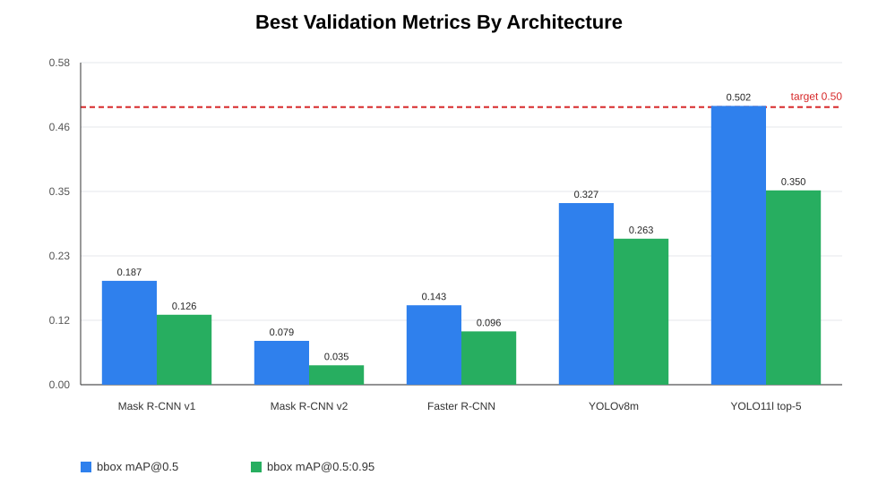
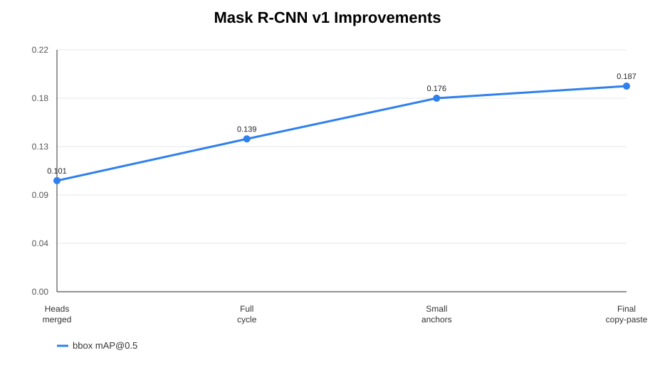
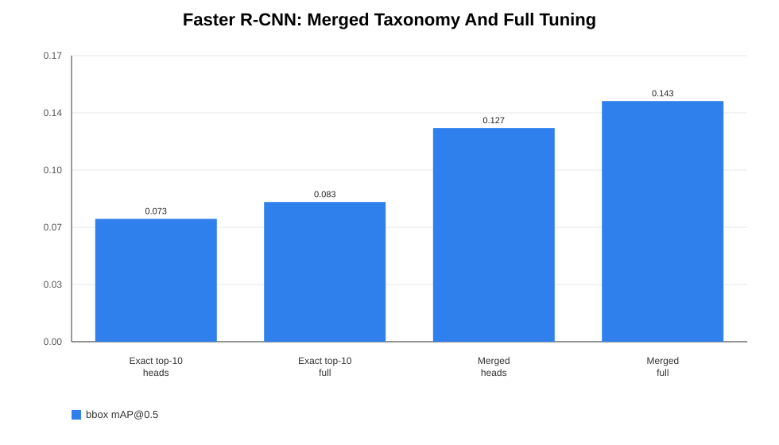
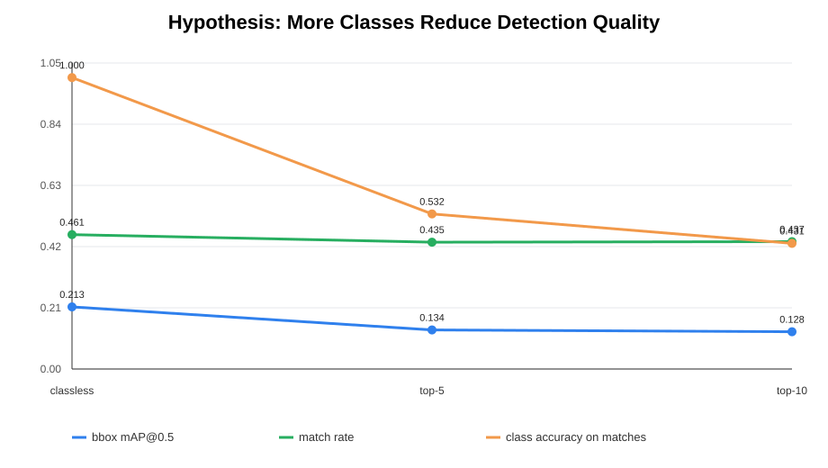
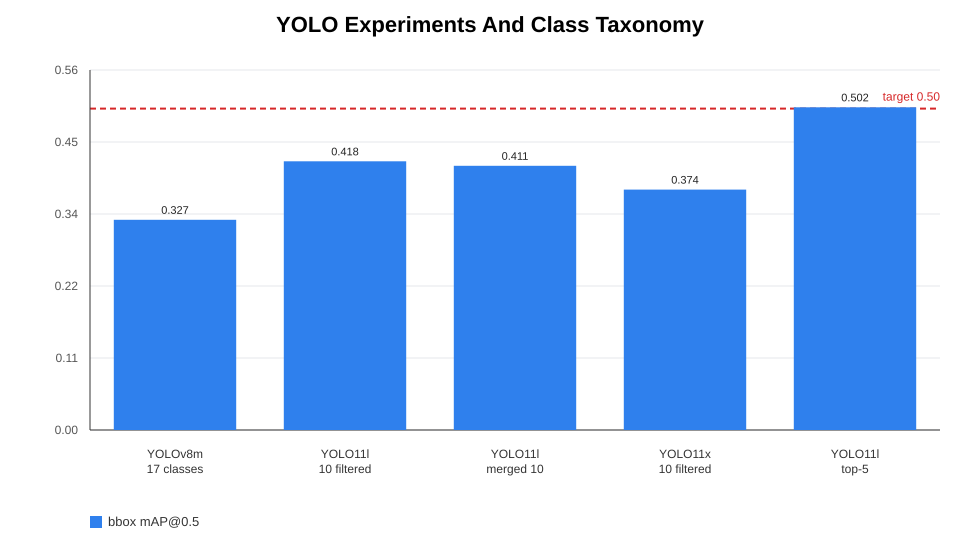

# Research Report: TACO Trash Detection And Segmentation

## 1. Task Description

The goal of this project is to train a computer vision model for detecting trash objects in images from the TACO dataset. Two related tasks were considered:

- **Object detection**: predict bounding boxes and class labels for trash objects.
- **Instance segmentation**: additionally predict an instance mask for each detected object.

The practical goal is to build a model that can be used in a web application for annotating trash images. The research goal is to compare several architectures, understand dataset limitations, and test hypotheses about why model quality drops when the number of classes increases.

Main research notebooks:

- [`notebooks/01_data_loading.ipynb`](../notebooks/01_data_loading.ipynb) - TACO loading and object-level dataframe construction.
- [`notebooks/02_eda.ipynb`](../notebooks/02_eda.ipynb) - EDA: classes, supercategories, object sizes, and objects per image.
- [`notebooks/03_train.ipynb`](../notebooks/03_train.ipynb) - baseline Mask R-CNN training.
- [`notebooks/04_experiments.ipynb`](../notebooks/04_experiments.ipynb) - hypotheses about classes, sampler, boxes, and object size.
- [`notebooks/05_mask_rcnn_v1.ipynb`](../notebooks/05_mask_rcnn_v1.ipynb) - main Mask R-CNN v1 pipeline.
- [`notebooks/05_mask_rcnn_v2.ipynb`](../notebooks/05_mask_rcnn_v2.ipynb) - Mask R-CNN v2 experiments.
- [`notebooks/05_fast_rcnn.ipynb`](../notebooks/05_fast_rcnn.ipynb) - Faster R-CNN baseline.
- [`notebooks/05_yolo_v8.ipynb`](../notebooks/05_yolo_v8.ipynb) - YOLOv8 baseline.
- [`notebooks/05_yolo_v11.ipynb`](../notebooks/05_yolo_v11.ipynb) - YOLO11 experiments and final model.

## 2. Dataset And EDA

The project uses the [TACO: Trash Annotations in Context](https://arxiv.org/pdf/2003.06975) dataset. The annotations contain images, bounding boxes, polygon segmentations, object classes, supercategories, and scene-level metadata.

Key EDA observations:

- The dataset is highly imbalanced: some classes are frequent, while others appear only a few times.
- A single image may contain many objects, sometimes dozens of instances.
- Many objects are small relative to the image size.
- Several categories are visually similar: plastic objects, wrappers, caps, bottles, and containers are often hard to separate.
- Catch-all labels such as `Other` or `Unlabeled litter` hurt classification because they group visually different objects into one class.

Conclusion from EDA: the task is difficult not only because of model architecture, but also because of the data itself: small objects, class imbalance, class ambiguity, and noisy labels.

## 3. Metric

The main project metric is **bounding-box mAP@0.5**.

For one class, Average Precision is the area under the precision-recall curve:

```math
AP_c = \int_0^1 p_c(r)\,dr
```

Mean Average Precision averages AP over all classes:

```math
mAP = \frac{1}{C}\sum_{c=1}^{C} AP_c
```

For `mAP@0.5`, a prediction is considered correct if the IoU between the predicted bounding box and the ground-truth box is at least `0.5`:

```math
IoU(B_p, B_{gt}) = \frac{|B_p \cap B_{gt}|}{|B_p \cup B_{gt}|}
```

Additional metrics were used:

- `bbox mAP@0.5:0.95` - COCO-style mAP averaged over IoU thresholds from `0.5` to `0.95`.
- `bbox mAP@0.75` - stricter localization metric.
- `bbox mAR@100` - recall with up to 100 detections.
- `match_rate` - fraction of ground-truth objects matched by predictions at IoU >= 0.5.
- `class_accuracy_on_matches` - classification accuracy among matched objects.
- For Mask R-CNN, segmentation mAP, Dice, generalized Dice, and mask mIoU were also tracked.

The TACO paper reports AP-style instance segmentation scores: `Class score`, `Litter score`, and `Ratio score`. These are related to COCO-style mask AP and are not directly equivalent to `bbox mAP@0.5`; therefore, they were used only as contextual reference.

## 4. Tested Architectures

### Mask R-CNN v1

Mask R-CNN v1 was used as the main two-stage segmentation architecture. It predicts bounding boxes, class labels, and instance masks. The experiments included:

- heads-only training;
- full fine-tuning;
- merged taxonomy;
- original boxes vs mask-derived boxes;
- small-object anchors;
- copy-paste augmentation for small objects;
- score-threshold tuning.

Best Mask R-CNN v1 result:

- `bbox mAP@0.5 = 0.187`;
- `bbox mAP@0.5:0.95 = 0.126`.

### Mask R-CNN v2

Mask R-CNN v2 was tested as a newer TorchVision variant. It was trained with a heads-only stage and several full fine-tuning cycles, but consistently underperformed v1.

Best result:

- `bbox mAP@0.5 ≈ 0.079`;
- `bbox mAP@0.5:0.95 ≈ 0.035`.

Conclusion: with the current pipeline, v2 did not improve the result and was not selected as a production model.

### Faster R-CNN

Faster R-CNN was tested as a detection-only baseline without a mask branch. The training logic mirrored Mask R-CNN: first raw top-10 classes, then merged taxonomy and full fine-tuning.

Best result:

- `bbox mAP@0.5 = 0.143`;
- `bbox mAP@0.5:0.95 = 0.096`.

Merged taxonomy improved Faster R-CNN, but the model remained much weaker than YOLO.

### YOLOv8m

YOLOv8m was used as a one-stage detector baseline. Even short smoke tests showed that YOLO learned bounding-box detection faster and reached stronger metrics than Mask/Faster R-CNN.

Final YOLOv8m result:

- `bbox mAP@0.5 = 0.327`;
- `bbox mAP@0.5:0.95 = 0.263`.

### YOLO11

YOLO11 was tested in several configurations:

- YOLO11m;
- YOLO11l;
- YOLO11x;
- exact top-10 classes;
- merged top-10 classes;
- filtered top-5 classes.

The best result was achieved by **YOLO11l top-5**:

- `bbox mAP@0.5 = 0.502`;
- `bbox mAP@0.5:0.95 = 0.350`;
- `precision = 0.592`;
- `recall = 0.497`.

This model was selected for inference because it was the only model that reached the target threshold `mAP@0.5 >= 0.5`. The limitation is that it solves a narrower task and supports only 5 classes.

## 5. Results

### 5.1 Best Model Comparison



| Model | Task | bbox mAP@0.5 | bbox mAP@0.5:0.95 |
|:--|:--|--:|--:|
| Mask R-CNN v1 | Detection + segmentation | 0.187 | 0.126 |
| Mask R-CNN v2 | Detection + segmentation | 0.079 | 0.035 |
| Faster R-CNN | Detection | 0.143 | 0.096 |
| YOLOv8m | Detection | 0.327 | 0.263 |
| YOLO11l top-5 | Detection | **0.502** | **0.350** |

Main conclusion: YOLO models were much more effective for bounding-box detection on this dataset. Two-stage models were useful for diagnostics and segmentation, but did not reach comparable bbox quality.

### 5.2 Mask R-CNN v1 Progression



Mask R-CNN v1 improved gradually:

- merged taxonomy reduced class confusion;
- full fine-tuning improved backbone features;
- small-object anchors helped small objects;
- copy-paste augmentation gave a small overall gain, but could hurt `map_small`.

Despite these improvements, the final result remained below YOLOv8 and YOLO11.

### 5.3 Faster R-CNN Ablation



Faster R-CNN confirmed the importance of label taxonomy. Moving from exact top-10 labels to merged classes increased `mAP@0.5` from about `0.083` to `0.143`. However, further training saturated quickly: match rate stayed around `0.35-0.39`, meaning that many objects were still not localized well enough at IoU >= 0.5.

### 5.4 Effect Of Number Of Classes



The hypothesis "too many classes hurt detection quality" was confirmed:

- classless setup had the highest mAP among quick checks;
- top-5 was better than top-10;
- class accuracy dropped as the number of classes increased.

This means the problem is not only localization, but also ambiguous classification of TACO categories.

### 5.5 YOLO And Taxonomy Trade-Off



YOLO11l top-5 reached the target `mAP@0.5 >= 0.5`, while top-10 and merged top-10 setups did not. Therefore, reducing the number of classes improves the metric but reduces the practical coverage of the application.

## 6. Tested Hypotheses

### Hypothesis 1: Too Many Classes Hurt Detection Quality

Confirmed. Classless and top-5 setups were better than top-10. Increasing the number of classes reduced `class_accuracy_on_matches` and mAP.

### Hypothesis 2: Some Classes Are Noisy / Poison Classes

Partially confirmed. Many errors were concentrated around visually similar and catch-all classes. This explains why merging and filtering classes improved stability.

### Hypothesis 3: Weighted Sampler Worsens Class Confusion

Not strongly confirmed. The sampler did not solve class ambiguity and was not a key improvement.

### Hypothesis 4: The Model Needs Fewer Categories, Not More Epochs

Confirmed. More training epochs often led to a plateau, while reducing or merging classes changed quality more noticeably.

### Hypothesis 5: Original Bbox Vs Mask-Derived Bbox Matters

Partially confirmed. For detection models, original annotation boxes are more appropriate. Mask-derived boxes are mainly useful when strong geometric transforms are applied.

### Hypothesis 6: Object Size Is A Major Reason For Low Detection Performance

Confirmed. Small objects were a major weakness of Mask R-CNN. Small anchors improved `map_small`, but did not solve the task completely.

### Hypothesis 7: "Other" Class Is Too Broad

Confirmed. `Other` groups visually unrelated objects and hurts classification. Removing catch-all labels or replacing them with a cleaner taxonomy improves stability.

### Hypothesis 8: Combined Improvements Should Help

The combination of merged taxonomy, full fine-tuning, tuned thresholds, small-object anchors, and augmentation produced the best Mask R-CNN v1 result, but it still underperformed YOLO.

## 7. Error Analysis

Main reasons for limited quality:

1. **Small objects.** Many objects occupy a tiny part of the image, which makes localization hard.
2. **Class ambiguity.** Similar categories differ only by subtle visual cues.
3. **Class imbalance.** Rare classes produce unstable AP and low recall.
4. **Catch-all labels.** `Other` and `Unlabeled litter` are not visually homogeneous classes.
5. **Crowded scenes.** Some images contain many objects, increasing false positives and missed detections.
6. **Different model objectives.** Mask R-CNN also optimizes a mask branch, while the main project metric is bbox mAP@0.5.

## 8. Possible Improvements

Potential next steps:

- Build a cleaner taxonomy without broad `Other` classes.
- Manually review or remove rare/noisy classes.
- Use cross-validation for a more reliable estimate.
- Tune small-object augmentation and tiling carefully; in current checks SAHI increased false positives.
- Test YOLO segmentation models if masks are required.
- Use semi-supervised relabeling or manual review for ambiguous categories.
- Tune confidence/NMS thresholds separately for production inference and validation reporting.

## 9. Final Conclusion

The research showed that model quality depends not only on architecture, but also heavily on class taxonomy. Two-stage models such as Mask R-CNN and Faster R-CNN were useful for analysis and segmentation, but reached relatively low bbox mAP on TACO. YOLOv8 and YOLO11 performed significantly better for bounding-box detection.

The best model was **YOLO11l top-5**, with:

- `bbox mAP@0.5 = 0.502`;
- `bbox mAP@0.5:0.95 = 0.350`.

This model was selected for inference. Its limitation is that it supports only 5 classes, so real-world category coverage is narrower than broader models. However, it was the only tested configuration that reached the target quality on the main metric.

